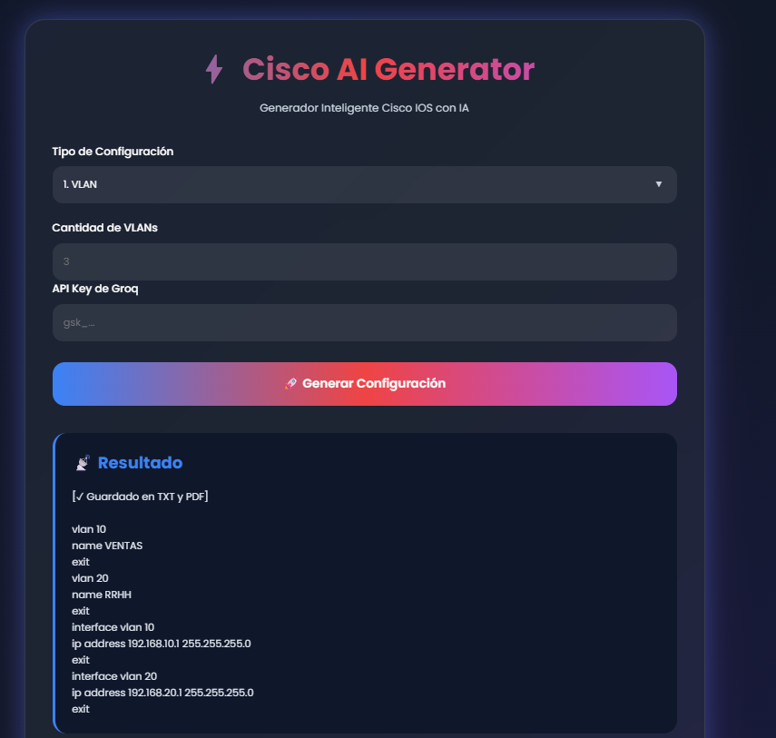
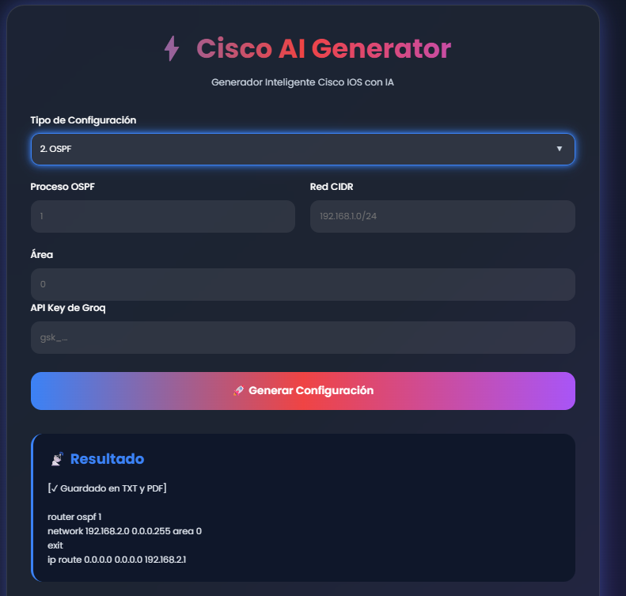
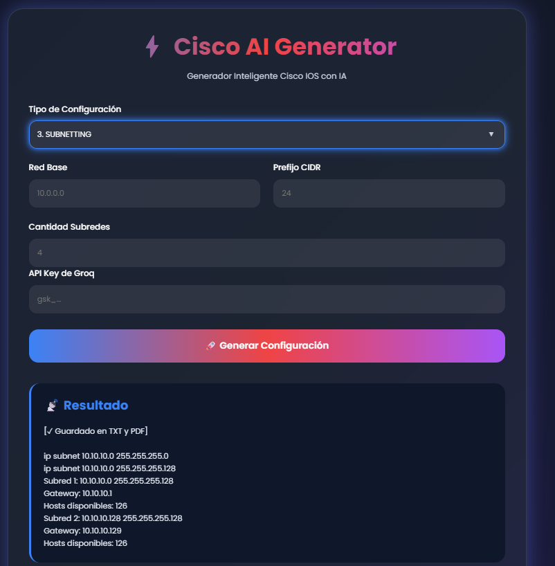

# ⚡ Cisco AI Generator

Generador inteligente de configuraciones Cisco IOS utilizando Inteligencia Artificial mediante la API de Groq y modelos LLM.

---

# 📌 Descripción del Proyecto

Cisco AI Generator es una aplicación web desarrollada con Python y Flask que permite generar configuraciones Cisco IOS de forma automática utilizando Inteligencia Artificial.

El sistema utiliza la API de Groq y modelos LLM para generar configuraciones listas para implementar en dispositivos Cisco. La aplicación facilita la creación de configuraciones de switching, routing, seguridad y servicios de red mediante una interfaz web intuitiva.

Las configuraciones generadas pueden visualizarse directamente desde la aplicación, descargarse en formato TXT o PDF y almacenarse en un historial para futuras consultas.

---

# 🎯 Objetivo del Proyecto

Automatizar tareas comunes de administración y configuración de redes Cisco para:

* Reducir errores humanos.
* Acelerar despliegues.
* Facilitar el aprendizaje de Cisco IOS.
* Estandarizar configuraciones.
* Ahorrar tiempo en tareas repetitivas.

---

# 🚀 Tecnologías Utilizadas

* Python 3.13
* Flask
* Groq API
* Llama 3.3 70B Versatile
* HTML5
* CSS3
* JavaScript
* ReportLab
* Docker
* Git
* GitHub
* Visual Studio Code
* python-dotenv

---

# 🧠 Funcionalidades Implementadas

Actualmente el sistema permite generar automáticamente:

### Switching

* VLAN
* TRUNK
* INTER-VLAN ROUTING
* PORT-SECURITY
* ETHERCHANNEL

### Routing

* STATIC ROUTE
* OSPF

### Servicios de Red

* DHCP
* NAT

### Seguridad

* ACL
* SSH

### Diseño y Planificación

* SUBNETTING
* DISEÑO AUTOMÁTICO DE RED

---

# 📡 Configuraciones Soportadas

## VLAN

Permite crear VLANs y asignarlas a interfaces específicas.

Ejemplo:

```cisco
vlan 10
name VENTAS

interface FastEthernet0/1
switchport mode access
switchport access vlan 10
no shutdown
```

---

## OSPF

Genera configuraciones de enrutamiento dinámico utilizando OSPF.

Ejemplo:

```cisco
router ospf 1
network 192.168.1.0 0.0.0.255 area 0
```

---

## STATIC ROUTE

Permite generar rutas estáticas para redes remotas.

Ejemplo:

```cisco
ip route 192.168.2.0 255.255.255.0 10.0.0.2
```

---

## DHCP

Genera pools DHCP para asignación automática de direcciones IP.

Ejemplo:

```cisco
ip dhcp pool LAN_VENTAS
network 192.168.1.0 255.255.255.0
default-router 192.168.1.1
dns-server 8.8.8.8
```

---

## ACL

Permite generar listas de control de acceso estándar y extendidas.

Ejemplo:

```cisco
access-list 100 permit ip 192.168.1.0 0.0.0.255 any
```

---

## SSH

Genera configuraciones seguras para acceso remoto mediante SSH.

Ejemplo:

```cisco
hostname SwitchCore

ip domain-name redes.local

username admin secret cisco1234

crypto key generate rsa

line vty 0 4
transport input ssh
login local
```

---

## NAT

Permite generar configuraciones de NAT estático, dinámico y PAT.

Ejemplo:

```cisco
access-list 1 permit 192.168.1.0 0.0.0.255

ip nat inside source list 1 interface GigabitEthernet0/1 overload

interface GigabitEthernet0/0
ip nat inside

interface GigabitEthernet0/1
ip nat outside
```

---

## PORT-SECURITY

Permite proteger puertos de acceso limitando dispositivos conectados.

Ejemplo:

```cisco
interface FastEthernet0/1
switchport mode access
switchport port-security
switchport port-security maximum 2
switchport port-security violation shutdown
```

---

## TRUNK

Genera configuraciones para enlaces troncales entre switches.

Ejemplo:

```cisco
interface GigabitEthernet0/1
switchport mode trunk
switchport trunk allowed vlan 10,20,30
```

---

## INTER-VLAN ROUTING

Permite la comunicación entre VLAN mediante Router-on-a-Stick.

Ejemplo:

```cisco
interface GigabitEthernet0/0.10
encapsulation dot1Q 10
ip address 192.168.10.1 255.255.255.0
```

---

## ETHERCHANNEL

Genera configuraciones EtherChannel utilizando LACP.

Ejemplo:

```cisco
interface range GigabitEthernet0/1-2
channel-group 1 mode active

interface Port-channel1
switchport mode trunk
```

---

## SUBNETTING

Ayuda a calcular subredes y máscaras según los requerimientos de hosts.

---

## DISEÑO AUTOMÁTICO DE RED

Genera propuestas completas de diseño de red incluyendo:

* VLAN
* Direccionamiento IP
* Routing
* Seguridad básica
* Servicios de red

---

## EVIDENCIAS IMAGENES







![Interfaz Principal]imagenes/DHCP.png()



---

# 🎨 Características de la Interfaz

* Diseño moderno y responsivo.
* Historial de configuraciones.
* Visualización inmediata de resultados.
* Descarga directa de archivos TXT y PDF.
* Gestión temporal de API Keys.
* Formularios dinámicos.
* Organización automática de configuraciones generadas.

---

# 🔒 Seguridad

## Gestión de API Key

La API Key de Groq es ingresada por el usuario desde la interfaz web.

Características:

* No se almacena permanentemente.
* Se mantiene únicamente durante la sesión activa.
* Se elimina al cerrar completamente la sesión.
* No se guarda en archivos del proyecto.

---

# 📄 Exportación de Configuraciones

Cada configuración generada se guarda automáticamente en:

* TXT
* PDF

Ejemplos:

```text
configs/nat_20260605_142300.txt
configs/nat_20260605_142300.pdf
```

---

# 📂 Historial de Configuraciones

La aplicación muestra automáticamente los archivos generados almacenados en:

```text
configs/
```

Los usuarios pueden visualizar el historial directamente desde la interfaz y descargar configuraciones anteriores.

Los archivos se ordenan automáticamente por fecha y hora de creación, mostrando primero los más recientes.

---

# 📥 Descarga de Archivos

Las configuraciones generadas pueden descargarse desde la aplicación.

Formatos disponibles:

* TXT
* PDF

---

# ⚡ Parámetros del Modelo

Configuración utilizada:

```python
temperature=0.2
max_tokens=800
```

---

# 📂 Estructura Actual del Proyecto

```text
eval-cisco-groq/
│
├── configs/
├── static/
├── templates/
│
├── .dockerignore
├── .env.example
├── .gitignore
├── Dockerfile
├── LICENSE
├── README.md
├── cisco_config_gen.py
├── requirements.txt
└── web_app.py
```

---

# 📋 Archivos Principales

| Archivo             | Descripción                                     |
| ------------------- | ----------------------------------------------- |
| web_app.py          | Aplicación principal Flask                      |
| cisco_config_gen.py | Generación de configuraciones Cisco mediante IA |
| requirements.txt    | Dependencias del proyecto                       |
| Dockerfile          | Configuración para despliegue en Docker         |
| .dockerignore       | Exclusión de archivos para Docker               |
| .env.example        | Ejemplo de variables de entorno                 |
| README.md           | Documentación principal del proyecto            |
| LICENSE             | Licencia MIT                                    |
| configs/            | Archivos TXT y PDF generados                    |
| static/             | Recursos gráficos y estilos                     |
| templates/          | Plantillas HTML de Flask                        |

---

# 🛠️ Instalación Local

## Clonar repositorio

```bash
git clone URL_DEL_REPOSITORIO
```

---

## Ingresar al proyecto

```bash
cd eval-cisco-groq
```

---

## Crear entorno virtual

```bash
py -3.13 -m venv venv
```

---

## Activar entorno virtual

```bash
venv\Scripts\activate
```

---

## Instalar dependencias

```bash
pip install -r requirements.txt
```

---

## Ejecutar aplicación

```bash
python web_app.py
```

---

# 🐳 Docker

## Construir imagen

```bash
docker build -t cisco-ai-generator .
```

---

## Ejecutar contenedor

```bash
docker run -p 5000:5000 -v "${PWD}/configs:/app/configs" cisco-ai-generator
```

Este volumen permite que los archivos TXT y PDF generados dentro del contenedor se almacenen permanentemente en la carpeta local `configs`.

---

## Abrir aplicación

```text
http://localhost:5000
```

---

# 🌐 Uso de la Aplicación

1. Abrir la aplicación web.
2. Ingresar una API Key válida de Groq.
3. Seleccionar el tipo de configuración.
4. Completar los parámetros solicitados.
5. Presionar:

```text
🚀 Generar Configuración
```

6. Visualizar el resultado generado por la IA.
7. Descargar el archivo TXT o PDF.
8. Consultar configuraciones anteriores desde el historial.

---

# 🔄 Control de Versiones

Git y GitHub son utilizados para:

* Control de versiones.
* Historial de cambios.
* Colaboración.
* Respaldo del proyecto.

Comandos utilizados:

```bash
git add .
git commit -m "Mensaje"
git push
```

---

# 📌 Estado Actual del Proyecto

## Últimas Actualizaciones

* Integración con API de Groq.
* Generación automática de configuraciones Cisco IOS.
* Interfaz web funcional con Flask.
* Historial de configuraciones generado automáticamente.
* Exportación de configuraciones en formato TXT y PDF.
* Soporte para Docker.
* Gestión temporal de API Keys.
* Formularios dinámicos para distintos tipos de configuraciones.
* Organización automática de archivos generados.
* Proyecto completamente funcional para pruebas y desarrollo.

---

# 👨‍💻 Autores

* Daniel Videla
* Pedro Roga
* Nicolas Bastidas

---

# 📜 Licencia

Licencia MIT.
