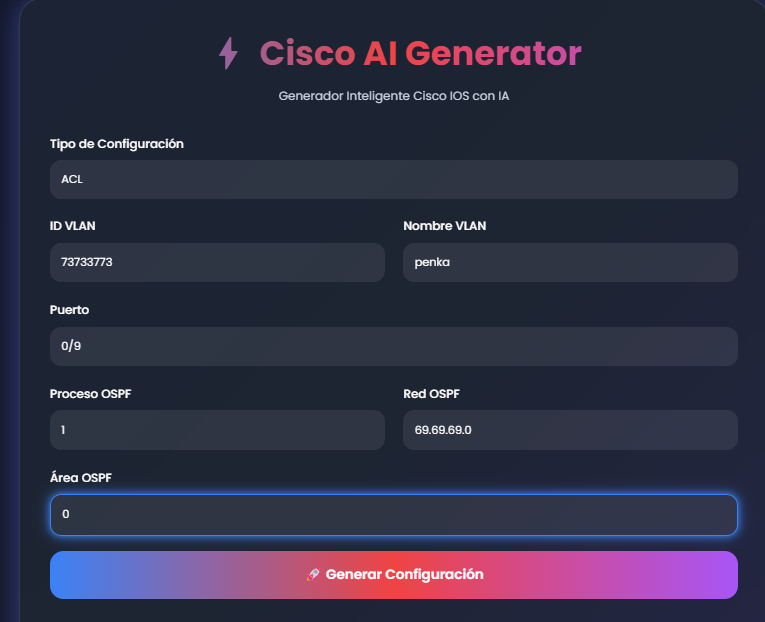
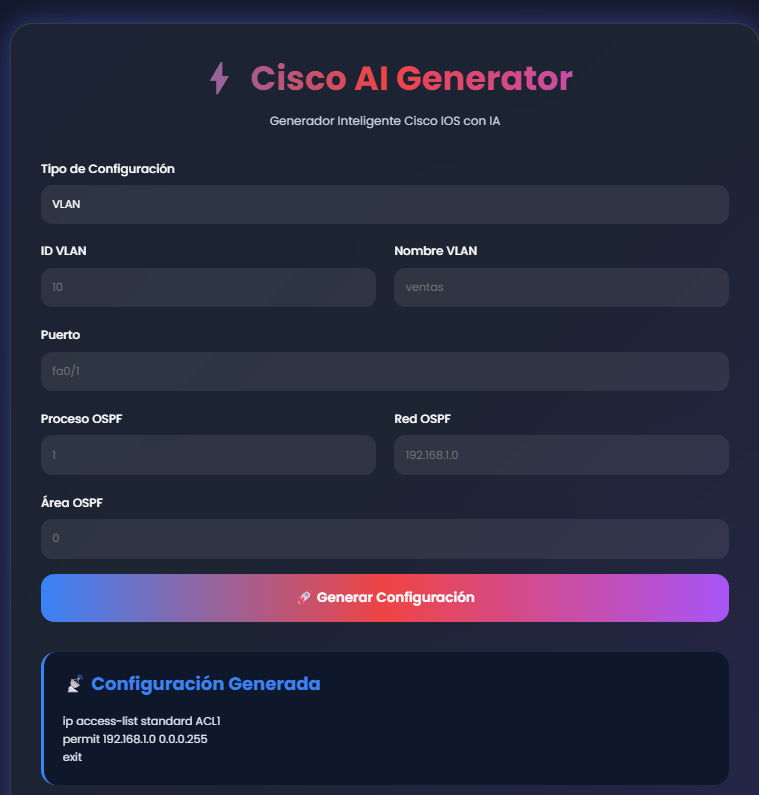
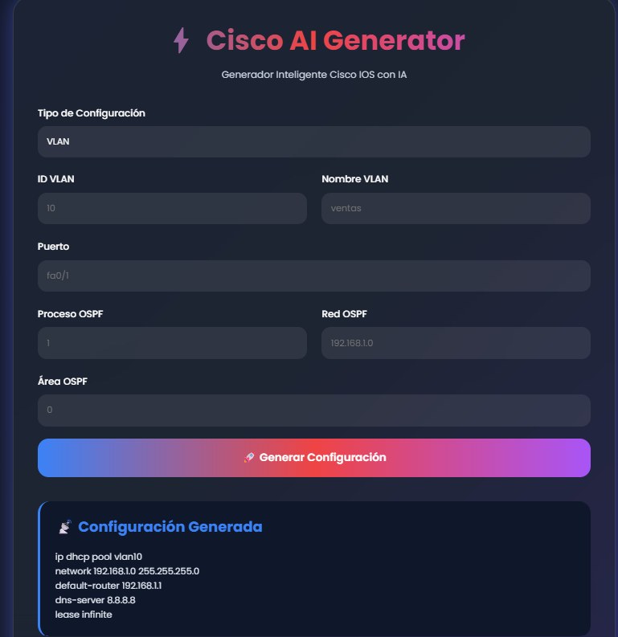

````md id="4o3m6v"
# ⚡ Cisco AI Generator

Generador inteligente de configuraciones Cisco IOS utilizando Inteligencia Artificial mediante la API de Groq y modelos LLM.

---

# 📌 Descripción del Proyecto

Este proyecto fue desarrollado como una herramienta de automatización de configuraciones Cisco IOS utilizando Python, Flask y modelos de IA.

La aplicación permite generar configuraciones de red automáticamente mediante prompts enviados a una IA especializada en redes Cisco.

## El sistema incluye:

- Interfaz web moderna y dinámica
- Generación automática de configuraciones Cisco IOS
- Integración con API de Groq
- Validaciones básicas de entrada
- Guardado automático de configuraciones
- Uso de Git y GitHub
- Manejo seguro de variables de entorno
- Streaming de respuestas en tiempo real

---

# 🎯 Objetivo del Proyecto

Automatizar tareas comunes de configuración Cisco mediante Inteligencia Artificial para facilitar:

- Creación rápida de configuraciones
- Reducción de errores manuales
- Estandarización de comandos
- Apoyo al aprendizaje de redes Cisco
- Optimización de tareas administrativas

---

# 🚀 Tecnologías Utilizadas

- Python 3.13.1
- Flask
- Groq API
- Modelo Llama 3.3 70B Versatile
- HTML5
- CSS3
- Git
- GitHub
- Visual Studio Code
- python-dotenv

---

# 🧠 Funcionalidades Implementadas

Actualmente el sistema permite generar automáticamente:

- VLAN
- OSPF
- SUBNETTING
- STATIC ROUTE
- DHCP
- ACL

---

# 📡 Ejemplos de Configuración

## 1️⃣ VLAN

```cisco
vlan 10
name ventas

interface fa0/1
switchport mode access
switchport access vlan 10
no shutdown
````

---

## 2️⃣ OSPF

```cisco
router ospf 1
network 192.168.1.0 0.0.0.255 area 0
```

---

## 3️⃣ STATIC ROUTE

```cisco
ip route 192.168.50.0 255.255.255.0 10.0.0.1
```

---

## 4️⃣ DHCP

```cisco
ip dhcp pool POOL_VENTAS
network 192.168.1.0 255.255.255.0
default-router 192.168.1.1
```

---

## 5️⃣ ACL

```cisco
access-list 100 permit 192.168.1.0 0.0.0.255
```

---

# 🎨 Características de la Interfaz

La aplicación web posee:

* Diseño responsive
* Estilo moderno tipo cyberpunk
* Colores dinámicos azul, rojo y morado
* Animaciones suaves
* Efectos glow
* Formularios intuitivos
* Visualización clara de resultados

---

# 🔒 Seguridad

## Protección de API Key

La clave privada de Groq se almacena en un archivo `.env`.

### Ejemplo:

```env
GROQ_API_KEY=TU_API_KEY_AQUI
```

---

## Exclusión de Archivos Sensibles

El archivo `.env` se protege mediante `.gitignore` para evitar subir credenciales privadas a GitHub.

### Contenido de `.gitignore`

```gitignore
venv/
__pycache__/
.env
```

---

# ✅ Validaciones Implementadas

El sistema valida entradas antes de consumir la API.

Actualmente se valida:

* VLAN numérica
* VLAN dentro del rango válido (1–4094)
* Proceso OSPF numérico
* Cantidad de subredes válida
* Selección correcta del menú

### Ejemplo de error

```text
ERROR: VLAN fuera de rango
```

---

# ⚡ Streaming en Tiempo Real

La respuesta generada por la IA puede visualizarse en tiempo real utilizando:

```python
stream=True
```

Esto permite observar cómo los comandos Cisco son generados progresivamente.

---

# ⚙️ Parámetros del Modelo

Configuración utilizada:

```python
temperature=0.2
max_tokens=800
```

---

# 💾 Guardado Automático

Todas las configuraciones generadas se almacenan automáticamente en la carpeta:

```text
configs/
```

### Ejemplo

```text
configs/vlan_20260513_154500.txt
```

Esto permite mantener historial de configuraciones generadas.

---

# 📂 Estructura del Proyecto

```bash
eval-cisco-groq/
│
├── configs/
│   ├── vlan_20260513.txt
│   ├── ospf_20260513.txt
│
├── templates/
│   └── index.html
│
├── static/
│   └── style.css
│
├── imagenes/
│
├── venv/
│
├── .env
├── .env.example
├── .gitignore
├── requirements.txt
├── web_app.py
├── README.md
```

---

# 🛠️ Instalación

## 1️⃣ Clonar repositorio

```bash
git clone URL_DEL_REPOSITORIO
```

---

## 2️⃣ Crear entorno virtual

```bash
py -3.13 -m venv venv
```

---

## 3️⃣ Activar entorno virtual

```bash
venv\Scripts\activate
```

---

## 4️⃣ Instalar dependencias

```bash
pip install -r requirements.txt
```

---

## 5️⃣ Crear archivo `.env`

Crear un archivo llamado:

```text
.env
```

Agregar:

```env
GROQ_API_KEY=TU_API_KEY
```

---

## 6️⃣ Ejecutar aplicación

```bash
python web_app.py
```

---

# 🌐 Uso de la Aplicación

1. Seleccionar tipo de configuración.
2. Completar parámetros solicitados.
3. Presionar el botón:

```text
🚀 Generar Configuración
```

4. La IA generará automáticamente comandos Cisco IOS válidos.
5. La configuración se mostrará en pantalla y se guardará automáticamente.

---

# 📸 Evidencias del Proyecto

## 🖥️ Interfaz Principal



---

## 🛡️ Configuración ACL



---

## 📡 Configuración DHCP



---

# 🔄 Control de Versiones

Se utiliza Git y GitHub para:

* Historial de cambios
* Respaldo del proyecto
* Colaboración
* Seguimiento de commits

## Comandos utilizados

```bash
git add .
git commit -m "Mensaje del commit"
git push
```

---

# 📌 Estado Actual del Proyecto

Proyecto funcional y conectado correctamente a la API de Groq.

## Características confirmadas

* API funcionando
* Generación automática Cisco IOS
* Interfaz web funcional
* Validaciones activas
* Streaming en tiempo real
* Guardado automático de configuraciones
* Repositorio conectado a GitHub

---

# 👨‍💻 Autores

* Daniel Videla
* Pedro Roga
* Nicolas Bastidas

---

# 📜 Licencia

Este proyecto utiliza licencia MIT.

```
```
